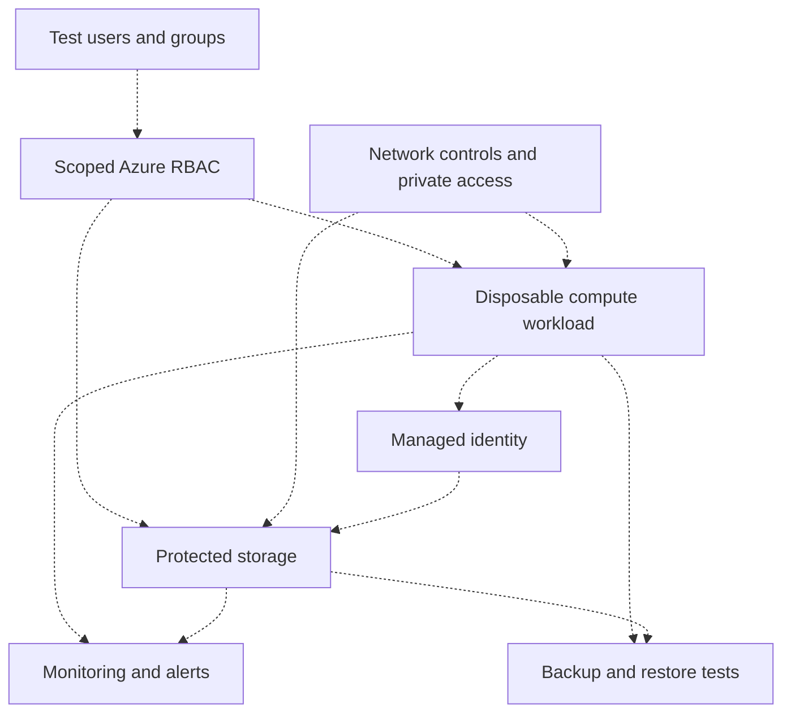

# MRTG architecture

**Status: documented foundation plus proposed Azure design. Azure live inventory pending Lab 01.**

## Existing foundation

The earlier IAM repository documents Hyper-V, `mrtg.local`, `MRTG-DC01`, `MRTG-DC02`, `MRTG-LOG01` (Splunk), and `MRTG-CLIENT-01`. Their present runtime state has not been verified in this series.

## Proposed Azure workload

Every node below is a target design, not deployment evidence. Dashed arrows denote proposed relationships. The diagram deliberately shows no on-premises synchronization or VPN connection: neither is established by this series yet.

Network reachability and identity authorization must both be tested; success at one does not establish the other. RBAC management access does not automatically establish data access.

## State register

| Component | Status | Evidence | Next verification |
|---|---|---|---|
| On-premises domain and systems | Documented in previous IAM series | [Prior repository](https://github.com/mattallen-it/MRTG-Enterprise-IAM-Lab-Series) | Confirm health only when needed |
| Azure tenant and subscription | Inventory pending | None for this series | Lab 01 |
| Cloud test identities and scoped roles | Planned | None | Labs 03–04 |
| Network and storage boundary | Planned | None | Labs 08–17 |
| Workload and managed identity | Planned | None | Lab 19 |
| Alerts and verified restore | Planned | None | Labs 25–29 |
| Hybrid identity or connectivity | Not implemented by this series | None | Optional later extension |

Update this register and the diagram after validation. If a deployment is removed, retain its historical evidence and label it removed; do not present it as currently running.
