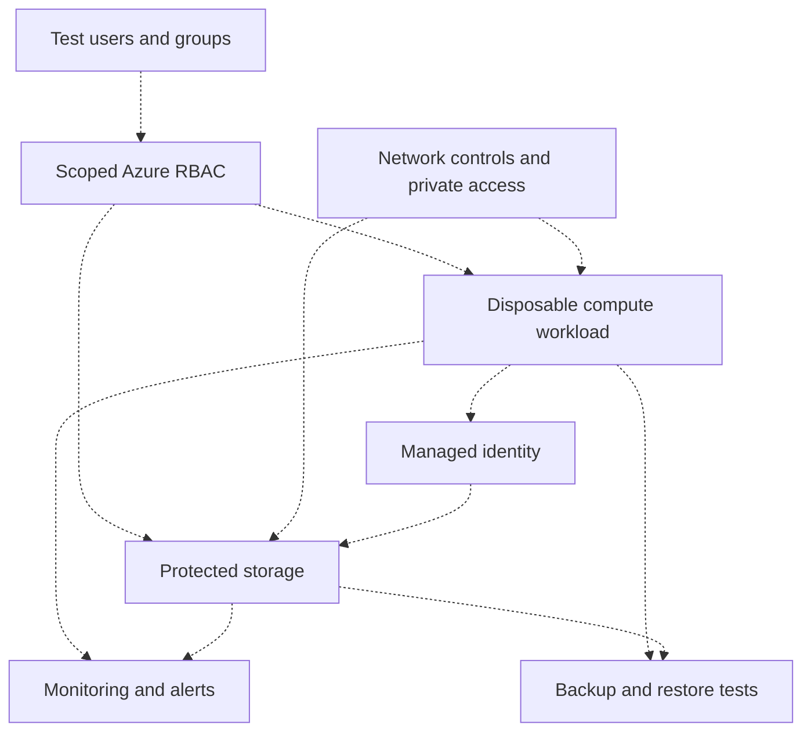

# MRTG architecture

**Status: Labs 01–02 baseline and organization validated; workload architecture remains proposed.**

The last verified baseline used the existing Entra directory and active `MRTG-AZ104-Lab-Subscription` with Owner access. A $10 monthly budget was configured. The temporary tagged resource group was deleted; no paid workload was deployed. This is recorded evidence, not a live inventory check. See [Lab 01](../labs/lab-01-subscription-inventory-and-cost-baseline/README.md).

## Observed Azure organization

[Lab 02](../labs/lab-02-resource-organization-and-management-hierarchy/README.md) recorded the subscription directly under **Tenant Root Group**. Two empty departmental groups in Central US were created and tagged, then deleted. The final resource-group list was empty. No management groups were created and the subscription was not moved.

## Existing foundation

The earlier IAM repository documents Hyper-V, `mrtg.local`, `MRTG-DC01`, `MRTG-DC02`, `MRTG-LOG01` (Splunk), and `MRTG-CLIENT-01`. Their present runtime state has not been verified in this series.

## Proposed Azure workload

Every node below is a target design, not deployment evidence. Dashed arrows denote proposed relationships. The diagram deliberately shows no on-premises synchronization or VPN connection: neither is established by this series yet.

Network reachability and identity authorization must both be tested; success at one does not establish the other. RBAC management access does not automatically establish data access.

## State register

| Component | Status | Evidence | Next verification |
|---|---|---|---|
| On-premises domain and systems | Documented in previous IAM series | [Prior repository](https://github.com/mattallen-it/MRTG-Enterprise-IAM-Lab-Series) | Confirm health only when needed |
| Azure directory, subscription, and budget | Baseline validated; retained at cleanup | [Lab 01](../labs/lab-01-subscription-inventory-and-cost-baseline/README.md) | Recheck context and costs at next session |
| Temporary Lab 01 resource group | Created, tagged, then deleted | Lab 01 creation and cleanup evidence | Recreate only when needed |
| Lab 02 departmental groups | Operations and Security groups created, then deleted | [Lab 02](../labs/lab-02-resource-organization-and-management-hierarchy/README.md) | Historical evidence; no groups retained |
| Management hierarchy | Tenant Root Group → lab subscription inspected | Lab 02 hierarchy capture | Recheck before hierarchy changes |
| Cloud test identities and scoped roles | Planned | None | Labs 03–04 |
| Network and storage boundary | Planned | None | Labs 08–17 |
| Workload and managed identity | Planned | None | Lab 19 |
| Alerts and verified restore | Planned | None | Labs 25–29 |
| Hybrid identity or connectivity | Not implemented by this series | None | Optional later extension |

Removed deployments remain documented as historical evidence. The proposed workload diagram does not represent running resources.
