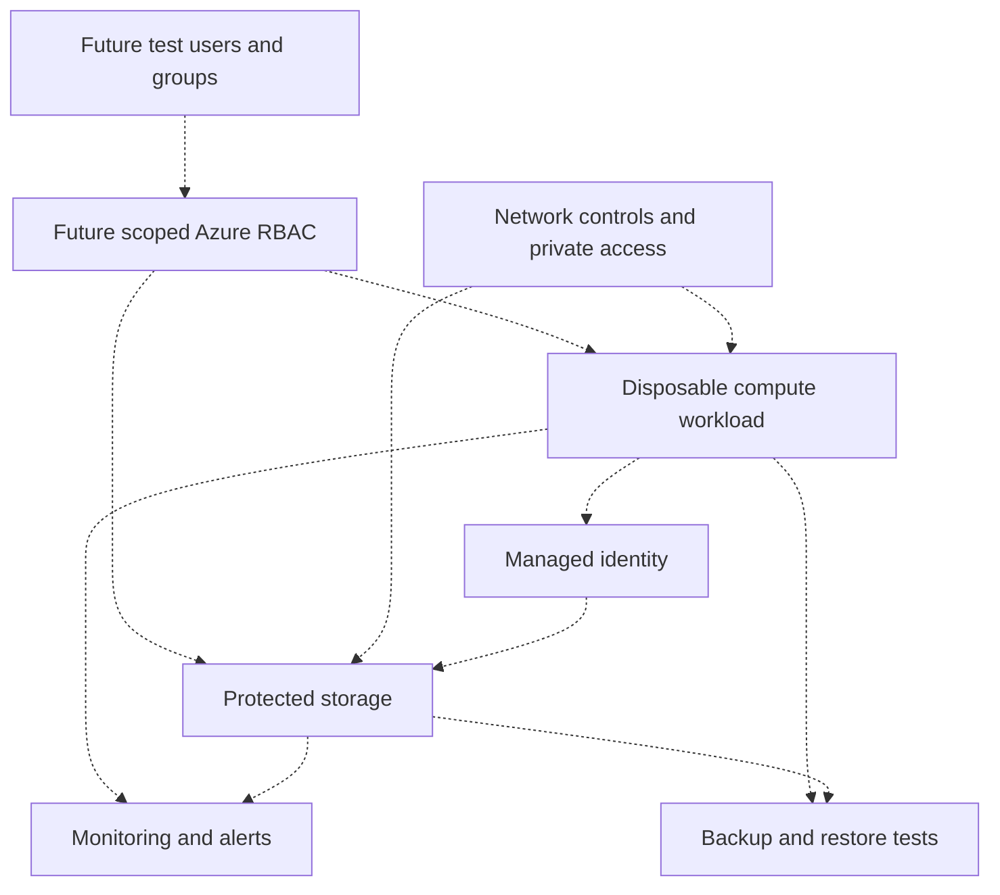

# MRTG architecture

**Status: Labs 01–11 validated. Labs 09–11 deployed disposable VMs for traffic filtering, peering, routing, DNS, and application availability tests, then removed their resource groups. Future storage, managed-identity, monitoring, and recovery architecture remains proposed.**

The initial Lab 01 baseline used the existing Entra directory and active `MRTG-AZ104-Lab-Subscription` with Owner access. A $10 monthly budget was configured. The temporary tagged resource group was deleted; no paid workload was deployed. Later workload deployments and cleanup are recorded below. This is historical evidence, not a live inventory check. See [Lab 01](../labs/lab-01-subscription-inventory-and-cost-baseline/README.md).

## Observed Azure organization

[Lab 02](../labs/lab-02-resource-organization-and-management-hierarchy/README.md) recorded the subscription directly under **Tenant Root Group**. Two empty departmental groups in Central US were created and tagged, then deleted. The final resource-group list was empty. No management groups were created and the subscription was not moved.

[Lab 04](../labs/lab-04-scoped-administration/README.md) recreated separate temporary Operations and Security resource groups. Assigned security groups received Reader and Contributor on Operations only. A Reader tag write was rejected, while the Operator saved a tag change; that Operator received 401 on Security and could not add a role assignment on Operations. Cleanup captures show no matching Lab 04 groups or resource groups and only the original administrator in active users; permanent deletion was not checked.

## Demonstrated workload networking

[Lab 09](../labs/lab-09-traffic-permissions/README.md) tested ASG-based HTTP access and a denied alternate port. Removing and restoring client ASG membership changed observed access; its resource group was deleted.

[Lab 10](../labs/lab-10-peering-and-route-investigation/README.md) connected Operations (`10.100.0.0/16`) and Security (`10.101.0.0/16`) by VNet peering. Ubuntu VMs at `10.100.10.4` and `10.101.10.4` passed ICMP and TCP/22 tests initiated from both sides. An Operations-subnet user route for `10.101.10.0/24` with next hop None caused packet loss and TCP failure. Removing the route restored the tested connectivity. Both VMs had no public IP; temporary default outbound access was explicitly enabled on their subnets. The Lab 10 group was removed, and its October 18 posted cost review showed USD 0.13.

[Lab 11](../labs/lab-11-name-resolution-and-application-availability/README.md) linked `mrtg.internal` to `vnet-mrtg-lab11-app` (`10.110.0.0/16`). The client at `10.110.20.4` resolved `app.mrtg.internal` to the internal Standard load balancer at `10.110.10.10`, serving nginx on web01 (`10.110.10.4`) and web02 (`10.110.10.5`). Stopping web02 nginx left successful requests through web01; restarting it returned both backends to observed traffic. An incorrect DNS A record caused named access to time out while direct frontend-IP access worked; restoring the record restored named access. Private subnets used explicit NAT egress and NIC NSGs. The group was deleted; October 21 posted cost was USD 0.15.

These results establish the tested network behavior. They do not establish application authentication, production hardening, hybrid connectivity, or a retained running environment.

## Existing foundation

The earlier IAM repository documents Hyper-V, `mrtg.local`, `MRTG-DC01`, `MRTG-DC02`, `MRTG-LOG01` (Splunk), and `MRTG-CLIENT-01`. Their present runtime state has not been verified in this series.

## Proposed Azure workload

Every node below is a target design, not deployment evidence. Dashed arrows denote proposed relationships. The diagram deliberately shows no on-premises synchronization or VPN connection: neither is established by this series yet.

```mermaid
flowchart TD
    U["Future test users and groups"] -.-> R["Future scoped Azure RBAC"]
    R -.-> C["Disposable compute workload"]
    R -.-> S["Protected storage"]
    N["Network controls and private access"] -.-> C
    N -.-> S
    C -.-> M["Managed identity"]
    M -.-> S
    C -.-> O["Monitoring and alerts"]
    S -.-> O
    C -.-> B["Backup and restore tests"]
    S -.-> B
```

Network reachability and identity authorization must both be tested; success at one does not establish the other. RBAC management access does not automatically establish data access.

## State register

| Component | Status | Evidence | Next verification |
|---|---|---|---|
| On-premises domain and systems | Documented in previous IAM series | [Prior repository](https://github.com/mattallen-it/MRTG-Enterprise-IAM-Lab-Series) | Confirm health only when needed |
| Azure directory, subscription, and budget | Baseline validated; retained at cleanup | [Lab 01](../labs/lab-01-subscription-inventory-and-cost-baseline/README.md) | Recheck context and costs at next session |
| Temporary Lab 01 resource group | Created, tagged, then deleted | Lab 01 creation and cleanup evidence | Recreate only when needed |
| Lab 02 departmental groups | Operations and Security groups created, then deleted | [Lab 02](../labs/lab-02-resource-organization-and-management-hierarchy/README.md) | Historical evidence; no groups retained |
| Management hierarchy | Tenant Root Group → lab subscription inspected | Lab 02 hierarchy capture | Recheck before hierarchy changes |
| Lab 03 cloud identities and groups | Two synthetic users and four groups created, then cleaned up | [Lab 03](../labs/lab-03-employee-and-contractor-lifecycle/README.md); active-list cleanup captured, permanent user deletion confirmed by operator | Historical evidence; no lab objects retained |
| Lab 04 scoped management roles | Reader and Contributor tested at temporary Operations resource-group scope; active-object cleanup captured, role removal operator-confirmed | [Lab 04](../labs/lab-04-scoped-administration/README.md) | Recreate scoped assignments if needed for a workload |
| Lab 06 recovery identity | Created, reset, password changed, recovery sign-in captured, and removed from active users | [Lab 06](../labs/lab-06-password-recovery-and-licensing/README.md); reset and target audit evidence; permanent deletion not verified | Historical evidence; recreate only if needed |
| Lab 07 manual review environment | Contributor corrected to Reader; reviewer read/write boundary tested; temporary assignment, resource group, group, and active user cleaned up | [Lab 07](../labs/lab-07-access-review-and-cost-review/README.md) | Historical evidence; no Lab 07 workload retained |
| Lab 08 address plan | VNet and two private subnets deployed; portal overlap validation captured; lab resource group deleted | [Lab 08](../labs/lab-08-address-plan-and-subnets/README.md) | Historical evidence; no Lab 08 VNet retained |
| NetworkWatcherRG | Present in the final unfiltered resource-group list; contents not inspected | Lab 08 cleanup capture | Inspect before using Network Watcher features |
| Lab 09 traffic controls | ASG HTTP tests, access removal/restoration, and cleanup validated | [Lab 09](../labs/lab-09-traffic-permissions/README.md) | Historical evidence; no Lab 09 workload retained |
| Lab 10 peering and routes | Two-VM connectivity, user-route failure, and recovery validated; group removed | [Lab 10](../labs/lab-10-peering-and-route-investigation/README.md); sanitized cleanup evidence published | Historical evidence; no Lab 10 workload retained |
| Lab 11 DNS and application availability | Private DNS, internal load balancing, backend failure/recovery and DNS fault isolation/recovery validated; group deleted | [Lab 11](../labs/lab-11-name-resolution-and-application-availability/README.md) | Historical evidence; no Lab 11 workload retained |
| Private access and storage boundary | Planned | None | Labs 12–17 |
| Managed identity for workloads | Planned; earlier traffic-test VMs did not establish identity-based data access | None | Later workload labs |
| Alerts and verified restore | Planned | None | Labs 25–29 |
| Hybrid identity or connectivity | Not implemented by this series | None | Optional later extension |

Removed deployments remain documented as historical evidence. The proposed workload diagram does not represent running resources.

