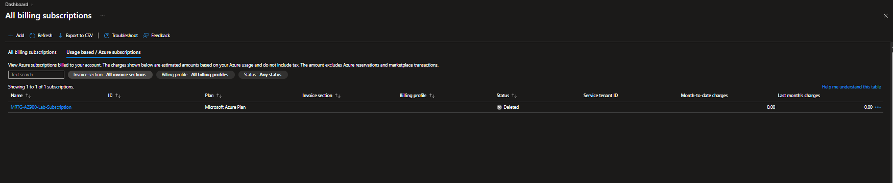
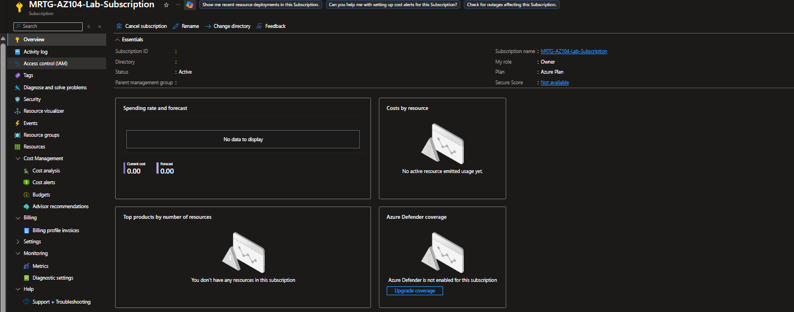
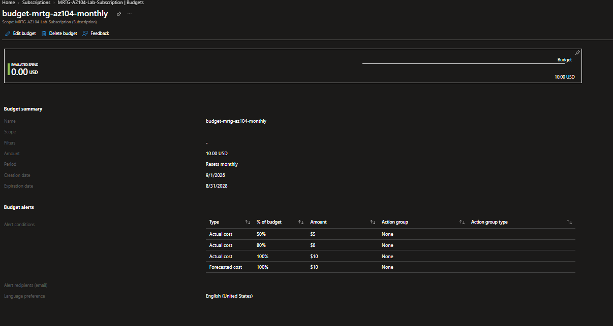
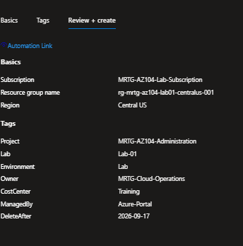
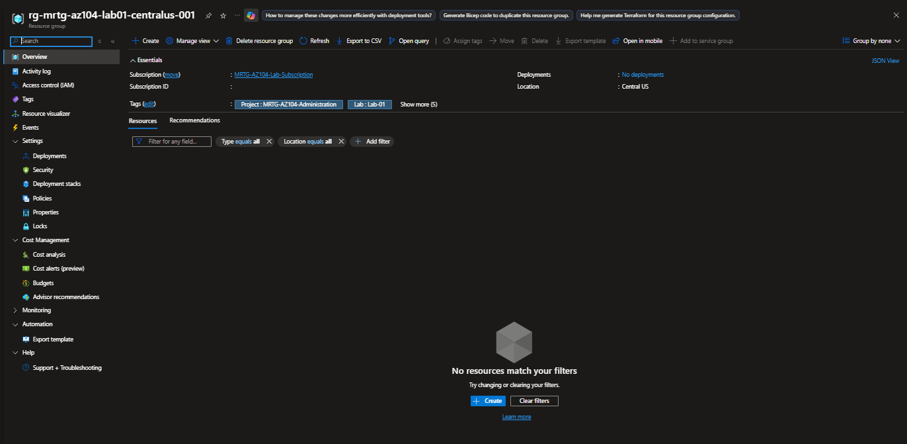
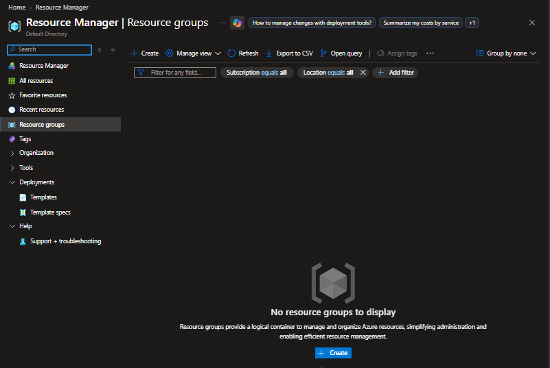

# Lab 01 — Subscription inventory and cost baseline

**Status: Validated — portal baseline and cleanup verified from user-provided screenshots and responses.**

Recorded September 17, 2026 (UTC). Section 3 command practice remains a later follow-up; course completion is not inferred.

## MRTG assignment

Request: establish a controlled place for MRTG cloud work. Inspect tenant, subscription, access, billing, credits, and existing resources. Create the series inventory and budget alerts; create and delete an empty tagged test resource group. Pass: explain tenant versus subscription, identify the billing scope, and prove that only the test group was removed. Detailed checklist below.

## Study alignment

- Udemy: section 1, lectures 2–5 (account access and budget); section 2, lectures 11–14 (concept review). Return for section 3, lectures 15–19, to practice read-only commands and subscription context.
- Microsoft Learn: [AZ-104 administrator prerequisites](https://learn.microsoft.com/en-us/training/paths/az-104-administrator-prerequisites/) and [Manage identities and governance](https://learn.microsoft.com/en-us/training/paths/az-104-manage-identities-governance/), focusing on subscription access, resource organization, and cost management.
- Study progress and hands-on completion are recorded separately.
- Follow the course mapping in [the series guide](../../docs/series-guide.md).

## Starting state and permissions

The dedicated MRTG account initially showed no accessible Azure subscriptions. The billing subscription list showed `MRTG-AZ900-Lab-Subscription` as Deleted. The cause of deletion was not established. Microsoft Entra ID Free remained active.

The user upgraded the billing account to pay-as-you-go with Basic support, then created `MRTG-AZ104-Lab-Subscription` in the existing Default Directory. The subscription overview confirmed Active status and Owner access. This is a personal lab subscription.

## Configuration and steps performed

1. Investigated the empty resource-access list through billing subscriptions and confirmed the old subscription's Deleted status.
2. Created the new subscription with Project, Environment, Owner, CostCenter, and ManagedBy tags.
3. Found that the subscription wizard's initial $10 budget reset annually. The user reported that the reset period could not be edited; the workflow replaced it with a monthly budget.
4. Verified saved `budget-mrtg-az104-monthly`: subscription scope, no filters, USD 10, monthly reset, September 1, 2026 through August 31, 2028.
5. Verified actual-cost alerts at 50%, 80%, and 100%, and forecast-cost alert at 100%. A dedicated MRTG email recipient is configured; action groups are None.
6. Confirmed an empty resource inventory before creating one temporary resource group.
7. Created `rg-mrtg-az104-lab01-centralus-001` in Central US with seven tags: Project=MRTG-AZ104-Administration, Lab=Lab-01, Environment=Lab, Owner=MRTG-Cloud-Operations, CostCenter=Training, ManagedBy=Azure-Portal, DeleteAfter=2026-09-17.
8. Inspected the group's empty resource list, manually deleted the group, and verified the resource-group list was empty.

## Validation and sanitized evidence record

The following observations are supported by the sanitized screenshots below, published September 18, 2026 (UTC). Account identifiers and the alert recipient address were masked by the author; blank areas represent redaction, not missing configuration. Original unredacted screenshots are not published. Screenshots document observed portal state rather than independently executable verification.

| Check | Expected | Observed evidence | Result |
|---|---|---|---|
| New subscription | Active with administrative access | Subscription overview: Active; My role: Owner | Passed |
| Budget correction | Monthly rather than annual reset | Saved budget overview: Resets monthly; USD 10; no filters | Passed |
| Alert configuration | Three actual thresholds and one forecast threshold | Saved overview: actual $5/$8/$10; forecast $10; recipient present | Configuration verified; delivery not tested |
| Cost baseline | Record currently reported amount | Subscription and saved budget views: USD 0.00 | Recorded; not a final invoice |
| Tagged group | Intended name, region, and tags | Creation review showed all seven tags; deployed overview showed group in Central US, Project/Lab tags, and five additional tags | Passed |
| Empty group | No workload resources | Group overview: no resources listed with type/location set to all | Passed |
| Cleanup | Temporary group absent | Resource groups list after deletion: No resource groups to display | Passed |

No permission-denial test was required for this inventory exercise. The observed failure was the missing usable subscription; the retest showed the new subscription Active with Owner access. The budget-period mismatch was corrected and the saved monthly configuration rechecked.

## Screenshot evidence

### Previous subscription investigation

The billing list shows the previous AZ-900 subscription as Deleted. This establishes its status, not the cause of deletion.

### New subscription and access

The new AZ-104 subscription is Active, the signed-in lab administrator has Owner access, and the portal reports 0.00 cost at inspection.

### Saved monthly budget

The saved USD 10 budget resets monthly, with actual alerts at 50%, 80%, and 100%, plus a forecast alert at 100%. This verifies configuration, not email delivery or a spending cap.

### Resource-group configuration review

The pre-creation review records the intended group name, Central US region, and all seven tags. DeleteAfter is a cleanup reminder, not an automated deletion mechanism.

### Created resource group

The deployed group overview confirms its existence and Central US location, with no resources listed and type/location filters set to all.

### Cleanup verification

After manual deletion, the resource-group list shows no resource groups to display. The subscription and monthly budget were retained.

## Cost and retained state

Only an empty resource group was created and removed; no VM or paid workload was deployed. Reported cost was USD 0.00 at inspection. Remaining credit was not verified and is not assumed. Retain the subscription and monthly budget. Recheck reported cost next session because reporting can lag. The $100 total series allowance is a manual planning limit, separate from the monthly alert budget.

## Troubleshooting and lessons

- An empty resource-access subscription list did not establish deletion; the billing list supplied the Deleted status.
- Upgrading the account did not by itself produce a visible active subscription; creation was completed afterward.
- The creation wizard's annual budget did not match the plan. Verify saved settings rather than relying on the budget name.
- A tenant is the identity directory holding users, groups, and applications; the portal is the management interface. A subscription is a billing and resource-management boundary linked to the directory. The initial tenant explanation required correction.
- The learner initially believed the $10 budget would block further activity. After correction, the learner confirmed that a running VM can continue generating charges beyond the budget.
- The learner correctly identified manual deletion as the cleanup action. DeleteAfter is metadata, not automatic deletion.

## Limits and follow-up

Alert configuration is verified; email delivery and threshold firing were not tested. No credit balance, final invoice, or paid-workload savings is claimed. Revisit read-only PowerShell/CLI context and inventory commands during Udemy section 3. Course and Microsoft Learn completion remain separately tracked.

## Execution checklist

Timebox: 60–90 minutes. New infrastructure: one empty resource group only. No VM required.

1. Open the Azure portal using the dedicated MRTG account. Check the directory and subscription selector. Record the actual tenant/subscription locally; sanitize identifiers in public evidence.
2. Open Subscriptions and inspect `MRTG-AZ900-Lab-Subscription`, or the actual MRTG subscription if its name changed. Confirm status and your assigned access. Stop configuration changes if this is an employer/client subscription.
3. Inspect All resources and resource groups filtered to that subscription. Record existing resources and their purpose. Do not delete leftovers until ownership is understood.
4. Open Cost Management at the subscription scope. Record month-to-date cost, currency, billing arrangement, and any verified remaining credit/expiration. Do not treat a remembered credit offer as active credit.
5. Inspect the existing $10 monthly budget; create it if absent and supported. Add actual-cost notifications at 50%, 80%, and 100%, plus a forecast notification if available, to your own address. Record if permissions or a newly created subscription prevent budget creation; resolve this before paid deployment.
6. Create `rg-mrtg-az104-lab01-centralus-001` in Central US. Apply `Project=MRTG-AZ104-Administration`, `Lab=Lab-01`, `Environment=Lab`, `Owner=MRTG-Cloud-Operations`, `CostCenter=Training`, `ManagedBy=Azure-Portal`, and `DeleteAfter=<today's UTC date>`.
7. Inspect the resource group's tags and confirm it contains no resources. Record its purpose in the inventory.
8. Explain aloud: Where do identities live? What scope holds resources and consumption? What does a budget do? What does it not do?
9. Delete only this named empty test group, then verify it is absent. Keep the budget and inventory.
10. Save sanitized before/after evidence and a short README. Record any cost-reporting delay and revisit reported charges at the next session.

Completion evidence: correct subscription identified; baseline inventory; budget configuration or documented blocker; tagged test group; verified deletion; explanations in your own words.

