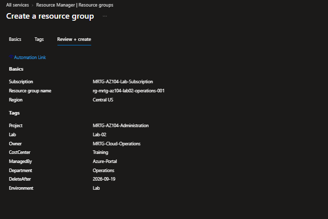
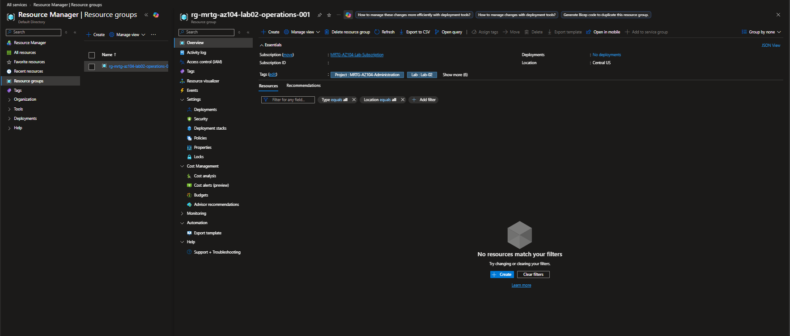
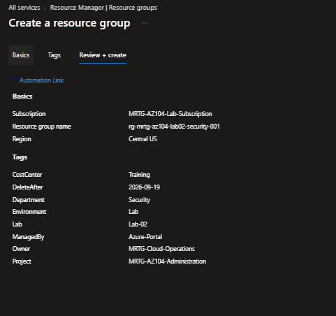
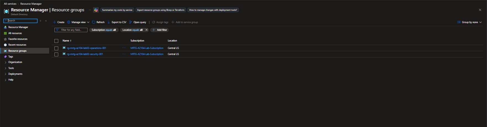
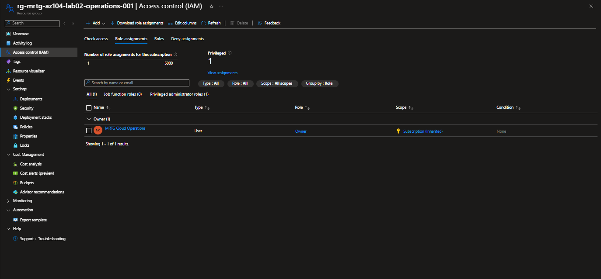
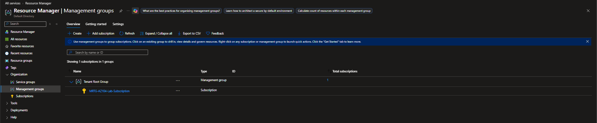
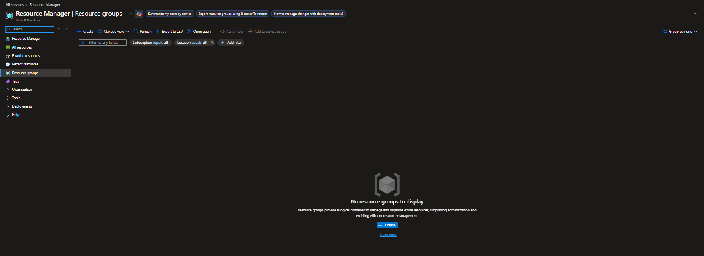

# Lab 02 — Resource Organization and Management Hierarchy

  

## Business problem

MRTG needed a consistent way to organize Operations and Security resources, identify accountable teams, and understand where administrator access originated. I created two departmental resource groups, applied a shared tagging scheme, inspected inherited access and the management hierarchy, then removed the temporary groups.

## Environment and configuration

The lab used the existing `MRTG-AZ104-Lab-Subscription` and its directory. Both resource groups were created in **Central US** and contained no deployed workloads.

| Resource group | Department |
|---|---|
| `rg-mrtg-az104-lab02-operations-001` | Operations |
| `rg-mrtg-az104-lab02-security-001` | Security |

| Tag | Value |
|---|---|
| Project | `MRTG-AZ104-Administration` |
| Lab | `Lab-02` |
| Environment | `Lab` |
| Owner | `MRTG-Cloud-Operations` |
| CostCenter | `Training` |
| ManagedBy | `Azure-Portal` |
| Department | `Operations` or `Security`, matching the group |
| DeleteAfter | `2026-09-19` |

`Owner` identified responsibility as metadata. `DeleteAfter` recorded the intended cleanup date; cleanup was performed manually.

## Work performed

### Created the Operations resource group

I reviewed the subscription, group name, region, and all eight tags before creation. The review capture records the submitted configuration.

After creation, the Overview page showed the Operations group in Central US, eight tags, no deployments, and an empty resource list with the type and location filters set to all.

### Created the Security resource group

I reused the shared tags and changed the group name and Department value for Security.

The resource-group list confirmed that both departmental groups existed in the intended subscription and region.

### Inspected inherited administrator access

I inspected **Access control (IAM) → Role assignments** on both groups. The administrator, displayed as `MRTG Cloud Operations`, held **Owner** through **Subscription (Inherited)**. The retained Operations capture shows that assignment and its source.

I also checked whether removing the Security group's `Owner` tag affected the inherited role. The role remained visible during the check, as reported during execution; no separate before-and-after screenshot was retained for this tag test.

The distinction matters for access reviews: a responsibility tag is not a role assignment. No new RBAC assignments were created, and no restricted test identity or live access-denial test was used. Departmental group names alone did not restrict the existing subscription Owner.

### Inspected the management hierarchy

The Management groups view showed **Tenant Root Group** with `MRTG-AZ104-Lab-Subscription` directly beneath it: one management group and one subscription. I inspected the existing hierarchy without creating a management group or moving the subscription.

### Removed the temporary groups

I deleted both Lab 02 resource groups. The final resource-group list showed **No resource groups to display**, with subscription and location filters set to all. The existing subscription and budget were retained; the budget was not revalidated in this lab.

## Validation results

| Check | Result | Evidence boundary |
|---|---|---|
| Departmental organization | Both named groups created in Central US | Resource-group list |
| Tag configuration | Eight tags reviewed for each group | Creation review captures; Operations overview shows eight tags |
| Inherited access | Subscription Owner visible at resource-group scope | Both groups inspected; Operations IAM capture retained |
| Tag versus permission | Owner role remained visible during tag-removal check | Execution report; no separate comparison capture |
| Management hierarchy | Subscription directly beneath Tenant Root Group | Management groups capture |
| Cleanup | Both temporary groups removed | Empty resource-group list |

## Troubleshooting and lessons

The global Resource Manager **Tags** view initially caused confusion because it listed tag values without showing the specific resource-group creation form. I verified each group's intended tags in its own **Review + create** page. The earlier global tag changes are not used as evidence of subscription tagging.

Consistent names and Department tags made the two scopes easy to identify. Reviewing the assignment's **Scope** column established why the administrator could manage both groups. A future least-privilege test needs a separate identity and an actual allowed/denied operation; this lab established the organization and inheritance baseline only.

## Outcome

Two departmental resource groups were created, documented, inspected, and deleted. No metered workload was deployed. The subscription overview displayed USD 0.00 at the start of the session; that was not a final bill or a post-cleanup cost measurement. See the [cost ledger](../../docs/cost-ledger.md) and [access-control matrix](../../docs/access-control-matrix.md).

[Back to the lab portfolio](../../docs/progress.md)
