# Lab 03 — Employee and contractor lifecycle

  

## Business problem

MRTG needed to onboard an employee and contractor, maintain departmental membership through an employee transfer, and remove the contractor's identity when the engagement ended. This lab demonstrates manual identity lifecycle administration in Microsoft Entra ID using synthetic accounts and assigned security groups.

## Configuration

Both accounts were cloud-created **Member** users in the existing directory. The contractor was a synthetic internal account, not an external B2B guest. No Azure RBAC or application permissions were attached to the lab groups.

| Identity | Initial membership | After employee transfer | Final state |
|---|---|---|---|
| MRTG Lab Employee (`lab03.employee`) | Employees and Operations | Employees and Security | Removed from active users; permanent deletion user-confirmed |
| MRTG Lab Contractor (`lab03.contractor`) | Contractors and Operations | Unchanged until offboarding | Disabled, memberships removed, deleted; permanent deletion user-confirmed |

Group names use the prefix `MRTG-AZ104-`: `Employees`, `Contractors`, `Operations`, and `Security`. All four were temporary lab objects.

## Joiner — created identities and assigned memberships

The user list showed both synthetic accounts alongside the original administrator.

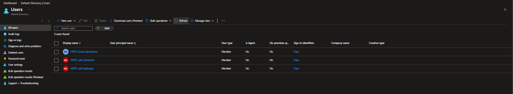

The Employees and Contractors groups were cloud security groups with **Assigned** membership.

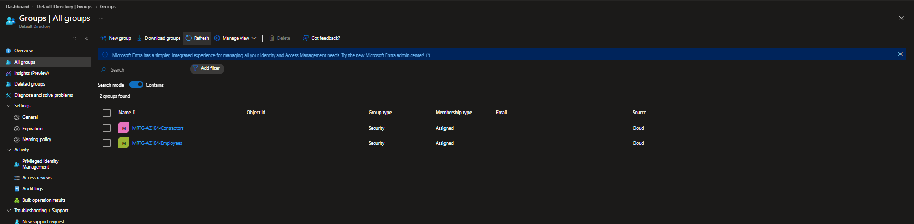

Each identity was placed in its corresponding workforce group.

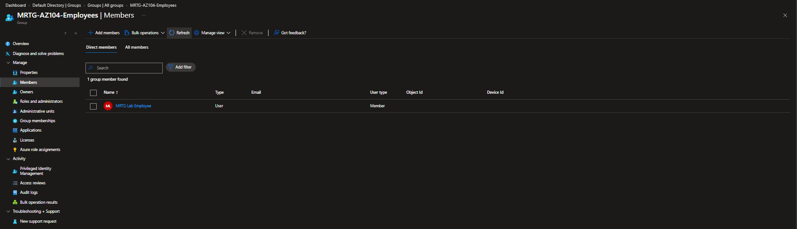

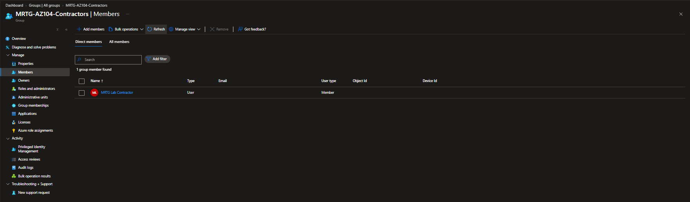

Both identities initially belonged to Operations, establishing the transfer baseline.

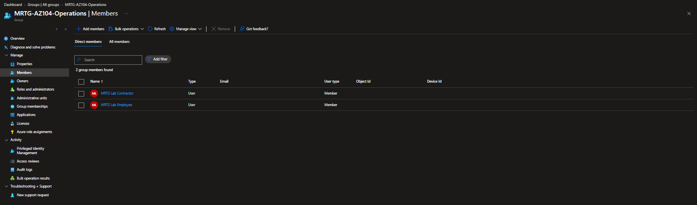

## Mover — changed departmental membership

The employee was removed from Operations and added to Security while retaining Employees membership. The employee's group list shows the resulting two memberships, with Operations absent.

Operations then contained only the contractor, corroborating removal of the employee from the old department group.

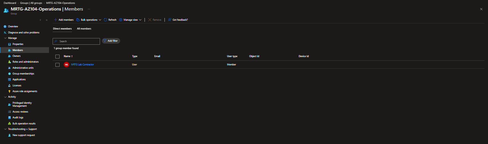

The planned profile changes were Department `Security` and Job title `Identity Security Analyst`. No properties capture was retained, so those values are not presented as screenshot-verified results. Changing membership here demonstrates directory administration, not authorization against a protected resource.

## Licensing boundary

The contractor's Licenses page showed **No license assignments found**. Its notice directed assignment changes to the Microsoft 365 admin center. This verifies the contractor's assignment state, not tenant-wide license availability or the employee's license state.

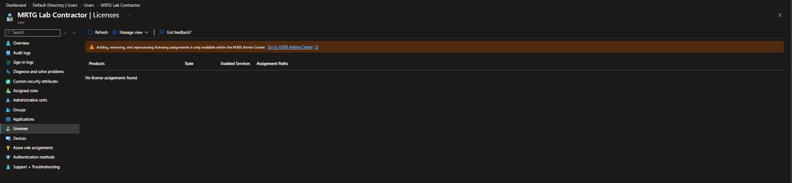

## Leaver — disabled and removed the contractor

The contractor's account status was **Disabled**. The overview also showed zero group memberships and zero assigned licenses at capture time.

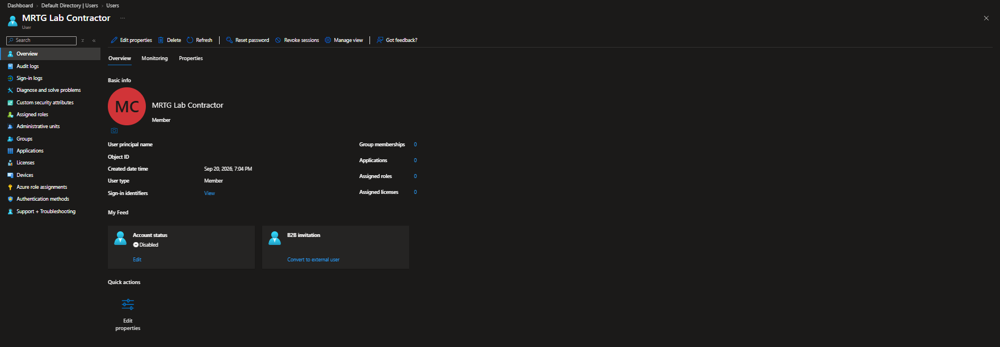

The Groups page independently confirmed **Not a member of any groups**.

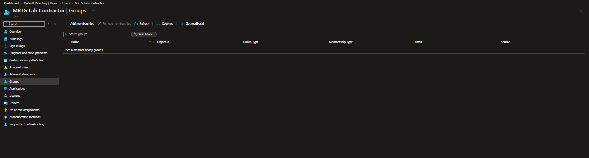

The contractor then appeared under **Deleted users**, establishing the recoverable-deletion stage. No restoration test was performed.

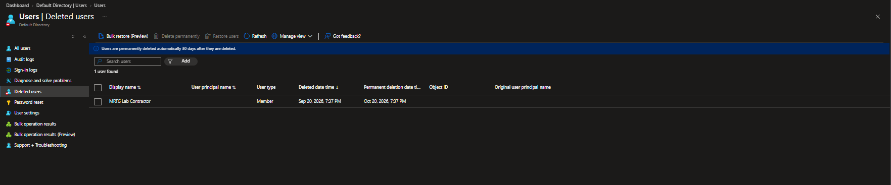

Session revocation was completed and confirmed by the operator, but no audit event or active-session test was captured. The visible Revoke sessions button is not evidence that revocation occurred or that every application session ended immediately. No fresh sign-in rejection test was retained.

## Cleanup

The employee was also removed, and all four lab groups were deleted. The final active-user list contained only the original administrator.

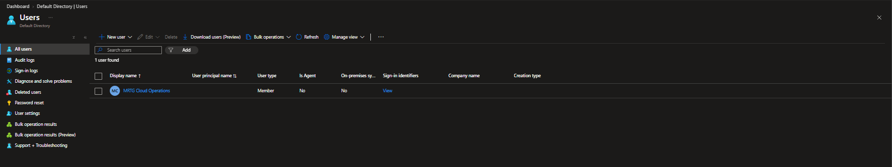

The final group list showed **0 groups found**.

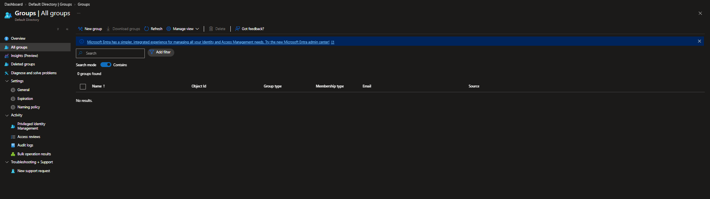

The operator confirmed session revocation and permanent deletion for both synthetic accounts. Permanent deletion is user-confirmed rather than screenshot-verified: an empty active-user list alone does not establish an empty Deleted users list. The original administrator, directory, subscription, and existing budget were not cleanup targets.

## Validation and limits

| Result | Evidence |
|---|---|
| Synthetic Member identities and memberships created | User, group, and member lists |
| Employee moved from Operations to Security | Before/after Operations membership and employee group list |
| Contractor had no assigned licenses | Contractor Licenses page |
| Contractor disabled and memberships removed | Disabled status and empty membership page |
| Contractor recoverably deleted | Deleted users page |
| Active lab users and groups removed | Final user and group lists |
| Sessions revoked and both users permanently deleted | Operator confirmation; no separate technical test capture |

## Lessons and outcome

The transfer preserved the employee classification while replacing departmental membership, avoiding accumulation of old memberships. Offboarding separated account disabling, membership removal, and deletion into visible stages.

An identity, its memberships, and permissions attached to those memberships are separate concepts. This lab validated directory state changes; it did not prove application access, Azure RBAC enforcement, or immediate session termination. Scoped allowed/denied operations remain part of Lab 04.

All temporary lab identities and groups were cleaned up. No paid workload was deployed for this directory exercise, and no cost screenshot or invoice was collected. See the [access-control matrix](../../docs/access-control-matrix.md) and [cost ledger](../../docs/cost-ledger.md).

[All labs](../../docs/progress.md)
