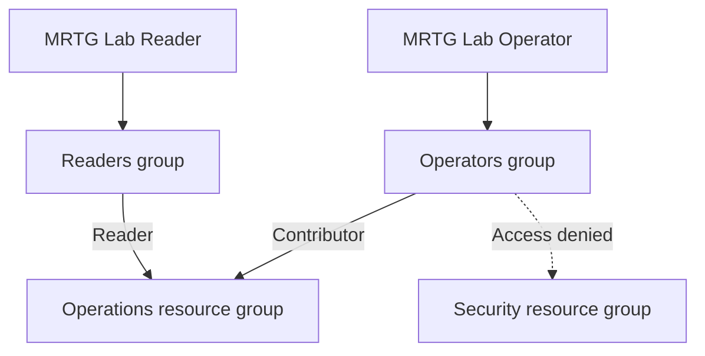
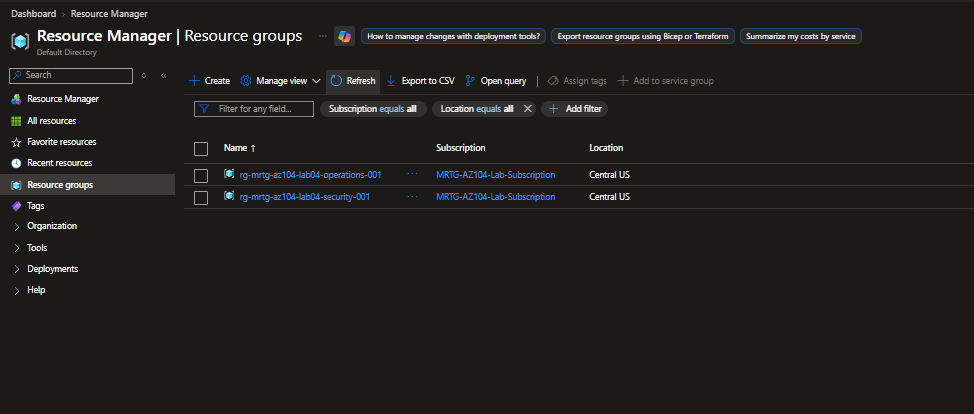
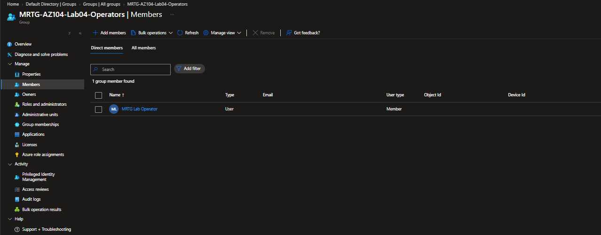
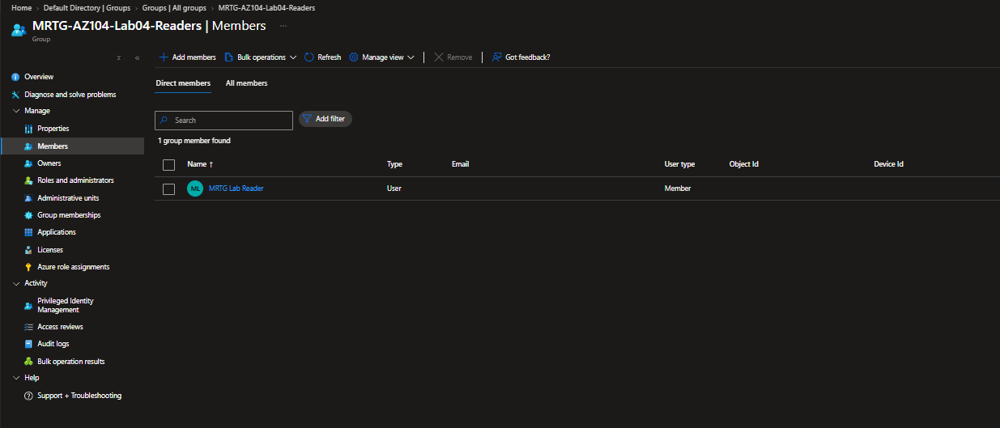
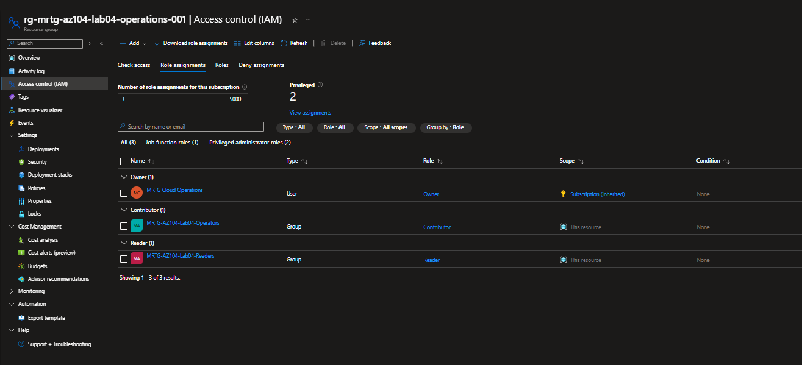
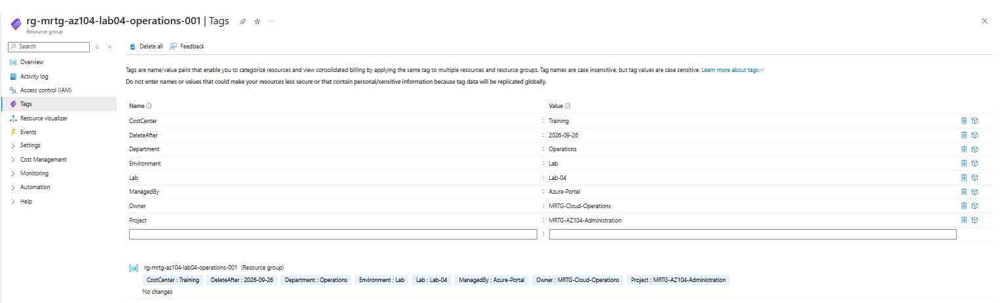
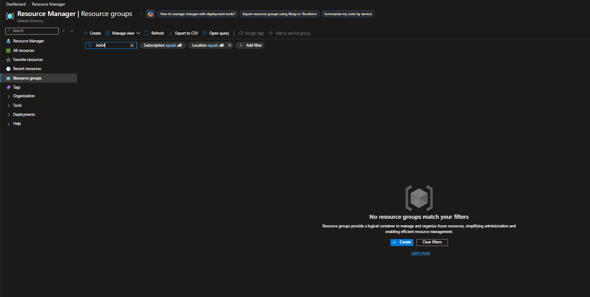
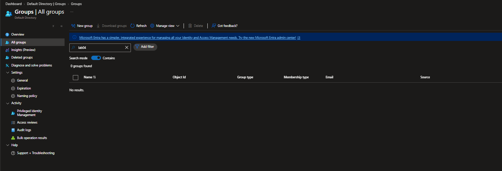
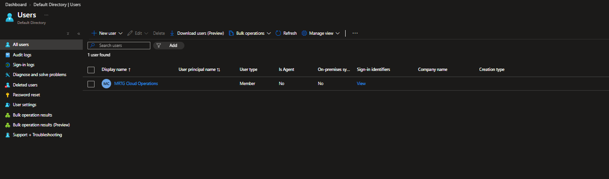

# Lab 04 — Scoped administration

  

## Purpose

MRTG needed an operator who could manage the Operations environment without controlling a separate Security environment or granting permissions to others. A reader needed visibility into Operations without write access. Success meant testing both permitted and rejected actions under the actual synthetic identities, not just checking that roles appeared in a list.

## Access design

Both resource groups were in Central US under `MRTG-AZ104-Lab-Subscription`. Azure RBAC was assigned to the security groups **at the Operations resource group**, not to the whole subscription. The original administrator's Owner role was inherited from the subscription. No Lab 04 role assignment was made on the Security resource group.

| Identity and group | Operations role | Intended ability | Boundary tested |
|---|---|---|---|
| MRTG Lab Reader → `MRTG-AZ104-Lab04-Readers` | Reader | Inspect the resource group and tags | Tag update rejected |
| MRTG Lab Operator → `MRTG-AZ104-Lab04-Operators` | Contributor | Update resources in Operations | Cannot open Security group or add an RBAC role assignment |
| MRTG Cloud Operations | Owner, inherited from subscription | Administer lab setup and cleanup | Kept separate from the test sessions |

Contributor is broad within its assigned scope; it is used here to demonstrate scope and the distinction between resource administration and permission delegation. No workload, data-plane permission, or custom role was tested.

## Implementation

Two temporary resource groups established the administration boundary.

The two synthetic accounts were Member users. Each had one assigned security-group membership, shown below.

The Operations IAM list displayed **Contributor** for the Operators group and **Reader** for the Readers group, each scoped to **This resource**. The administrator Owner entry showed **Subscription (Inherited)**.

## Validation

| Test identity | Action | Observed result | Evidence |
|---|---|---|---|
| Reader | Open Operations and attempt to change `Environment` from `Lab` to `Test` | Tags were visible; Save returned `AuthorizationFailed`. The existing `Environment: Lab` chip remained. | [Reader write rejected](screenshots/lab04-reader-tag-change-denied.png) |
| Operator | Change the same tag from `Lab` to `Test` | Saved value showed `Environment: Test` with **No changes** pending. | [Operator write allowed](screenshots/lab04-operator-tag-change-allowed.png) |
| Operator | Open the Security resource group | Portal returned **You don't have access**, error code `401`, for that resource group. | [Security access rejected](screenshots/lab04-operator-security-access-denied.png) |
| Operator | Open Operations IAM and select Add | **Add role assignment** was disabled for the signed-in operator. No role assignment was created. | [Role delegation unavailable](screenshots/lab04-operator-role-assignment-denied.png) |

The Operator restored `Environment: Lab` afterward; the saved chip and **No changes** state are visible in the final capture.

The Reader rejection screenshot identifies `lab04.reader` in the portal header; the Operator screenshots identify `lab04.operator` or include the account in the access error. No independent activity-log export or API authorization test was collected.

## Lessons learned

The portal allowed a Reader to type a new tag value, which could have been mistaken for edit access. The actual permission check happened on **Save**: Azure rejected the write and retained the original value. For access reviews, test the final operation and verify persisted state. Contributor permitted a resource-group tag update but did not let the Operator assign Azure roles, and its Operations grant did not extend to Security.

## Cleanup and limits

After validation, the resource-group list filtered to `lab04` showed **no matching resource groups** under the portal's all-subscriptions and all-locations filters.

The Entra groups list filtered to `lab04` showed **0 groups found**, and the active-user list showed only the original administrator.

These captures verify the absence of the Lab 04 groups and resource groups from the filtered lists and the absence of the two synthetic accounts from **active users** at capture time. The operator separately confirmed the two Lab 04 role assignments were removed. The screenshots do not show a role-assignment deletion audit event, a permanent deletion check under **Deleted users**, or a complete Azure resource inventory. The existing administrator, subscription, and budget were outside cleanup scope.

No metered workload was deployed. No post-session cost or invoice capture was collected; see the [cost ledger](../../docs/cost-ledger.md). The lab demonstrates Azure management-plane authorization for these specific actions, not application access, data-plane access, or regulatory compliance.

[All labs](../../docs/progress.md) · [Access matrix](../../docs/access-control-matrix.md)
