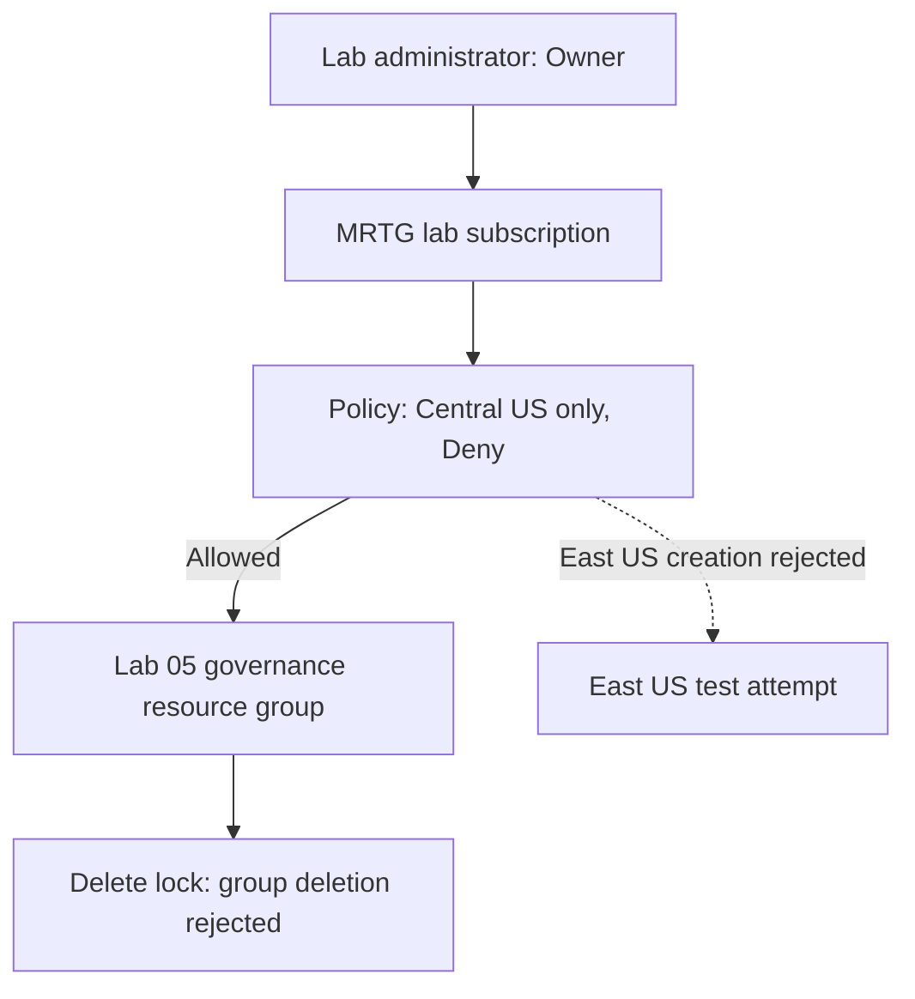

# Lab 05 — Guardrails with policy and locks

 

## Purpose

MRTG wants its lab resource groups created only in Central US and wants a temporary governance group protected from accidental deletion. This lab tests two different management-plane guardrails: **Azure Policy** decides whether a new resource group may be created in a region; a **Delete lock** blocks deletion of an existing group, even for an Owner.

**Success:** a Central US group is created, an East US group creation is rejected by the named policy, and deleting the protected Central US group is rejected until its lock is removed. No virtual machines or other metered workloads are needed.

## Design

The policy assignment is at **subscription scope** because the test creates new resource groups. Do not scope it to the governance resource group: a new East US group would be outside that scope. The lock is at **resource-group scope**. Azure RBAC grants the administrator permission to try these actions; policy and locks still restrict the operations.

## Procedure and evidence

Use `MRTG-AZ104-Lab-Subscription` throughout. Save a screenshot only when a row below calls for one. Do not treat a policy assignment's initial **Not started** or **100% (0 resources)** display as a validation result.

| Step | Portal action | Expected result | Screenshot to keep |
|---|---|---|---|
| 1 | In **Policy → Assignments**, check this subscription for an earlier `lab05-*` assignment. Remove any abandoned Lab 05 assignment before starting. In **Resource groups**, check that abandoned Lab 05 test groups are gone. | Clean starting point; leave unrelated assignments, including `ASC Default`, alone. | None |
| 2 | **Policy → Assignments → Assign policy**. Scope: the lab **subscription**; Exclusions: blank; definition: **Allowed locations for resource groups**; name: `lab05-deny-rg-location`; Policy enforcement: **Default**. Under **Parameters**, choose **Central US** only and **Effect: Deny**. Review and create. | The assignment controls resource-group creation anywhere in this subscription. | `lab05-deny-policy-configuration.png` — Review + create page showing scope, no exclusions, and `centralus`; the retained review page does not display Effect |
| 3 | **Resource groups → Create**. Create `rg-mrtg-az104-lab05-governance-001` in **(US) Central US**. Leave it empty. | Creation succeeds in the allowed region. | `lab05-centralus-group-created.png` — resource-group list showing subscription and Central US |
| 4 | **Resource groups → Create**. In the same subscription, enter `rg-mrtg-az104-lab05-deny-eastus-001` and **(US) East US**. Inspect the region field for the named policy rejection. If it blocks the request here, capture that result and cancel the attempt. | Azure rejects the request. Open the error details and verify they identify `RequestDisallowedByPolicy` or the `lab05-deny-rg-location` assignment. If another assignment caused the rejection, this test does **not** validate the Lab 05 policy. | `lab05-eastus-creation-denied.png` — rejection with the policy identifier visible |
| 5 | Open the Central US governance group → **Settings → Locks → Add**. Name: `lab05-delete-protection`; lock type: **Delete**. Save. | The lock appears on this resource group. | `lab05-delete-lock-applied.png` — lock name and type |
| 6 | On that group's Overview, select **Delete resource group**, enter its name, and submit the deletion attempt. | Azure rejects deletion because of the lock. Verify the error identifies a lock. | `lab05-locked-group-delete-denied.png` — actual rejection, not only the confirmation dialog |
| 7 | Return to **Locks** and remove `lab05-delete-protection`. Delete the governance resource group. Then remove `lab05-deny-rg-location` from **Policy → Assignments**. Check the resource-group list and assignment list. | The temporary group and subscription-wide lab policy are gone. | `lab05-resource-group-cleanup.png` — Resource groups filtered to `lab05`; `lab05-policy-cleanup.png` — **Authoring → Assignments**, subscription scope, searched for `lab05` |

**Stop if Step 4 is allowed.** Check the exact policy definition, subscription scope, empty Exclusions, allowed location, **Effect: Deny**, and **Policy enforcement: Default**. Do not claim a successful Deny test from a compliance chart. If the portal reports a propagation delay, wait and retry with a *new* East US group name; do not delete or recreate the Central US group merely to refresh the chart.

**Stop if Step 6 deletes the group.** The lock was not in force at the tested scope. Recheck the group's Locks blade before continuing. Never lock the subscription for this exercise.

## Validation record

The following results were reviewed from the completed portal exercise.

| Test | Observed result | Evidence |
|---|---|---|
| Policy configuration | Subscription scope, no exclusions, Central US allowed, Default enforcement, and assignment name visible. Effect is absent from the retained review screenshot. | [Configuration](screenshots/lab05-deny-policy-configuration.png) |
| Central US creation | Governance group present in the lab subscription in Central US. | [Allowed group](screenshots/lab05-centralus-group-created.png) |
| East US attempt | Portal displayed a policy rejection beside East US identifying `lab05-deny-rg-location`. The attempt was cancelled before deployment. | [Policy rejection](screenshots/lab05-eastus-creation-denied.png) |
| Delete lock applied | `lab05-delete-protection` shown as Delete at the governance group scope. | [Lock](screenshots/lab05-delete-lock-applied.png) |
| Deletion blocked | Azure notification stated that the governance group was locked and could not be deleted. | [Blocked deletion](screenshots/lab05-locked-group-delete-denied.png) |
| Resource-group cleanup | Reviewed Resource groups list showed no matches for `lab05`. | [Resource-group cleanup](screenshots/lab05-resource-group-cleanup.png) |
| Policy cleanup | Authoring → Assignments showed zero matches for `lab05` at the lab subscription scope. | [Assignments cleanup](screenshots/lab05-policy-cleanup.png) |

## Troubleshooting and lessons learned

The earlier Audit attempt depended on a compliance dashboard that had not evaluated the test groups. An initial 100% result with zero evaluated resources did not prove compliance. The exercise was restarted using Deny so the portal's rejection supplied an immediate checkpoint.

The cleanup capture initially showed resources inside the governance group, then the Policy Compliance page. The corrected checks used the subscription's Resource groups list and **Authoring → Assignments**. Screenshot filenames describe evidence; the selected portal view determines what that evidence proves.

This connects Lab 04's scoped access work to governance: permission to manage a resource does not establish that every operation will be permitted. Region policy and deletion protection add constraints to authorized administration.

## Limits and cleanup

The East US evidence demonstrates a portal policy rejection before deployment; it does not contain a submitted ARM deployment failure or a captured `RequestDisallowedByPolicy` response. The retained configuration screenshot does not show Effect, so enforcement is evidenced by the named policy rejection.

The lock test verifies management-plane deletion protection. Data-plane behavior and independent RBAC denial were not tested in this lab. The operator removed the lock, deleted the governance group, and removed the assignment; the final filtered lists were reviewed. A separate lock-removal screenshot was not retained.

Only an empty resource group, policy assignment, and management lock were used. No metered workload was deployed for this exercise; subscription-wide charges were not independently verified.

## References

- [Azure Policy built-in definitions](https://learn.microsoft.com/en-us/azure/governance/policy/samples/built-in-policies)
- [Assign a policy in the Azure portal](https://learn.microsoft.com/en-us/azure/governance/policy/assign-policy-portal)
- [Azure Policy compliance evaluation and timing](https://learn.microsoft.com/en-us/azure/governance/policy/how-to/get-compliance-data)
- [Lock Azure resources](https://learn.microsoft.com/en-us/azure/azure-resource-manager/management/lock-resources)

[All labs](../../docs/progress.md)
