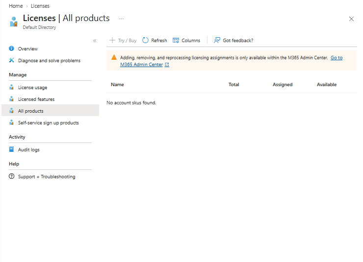

# Lab 06 — Password recovery readiness and licensing

 

## Business problem

MRTG needed to establish whether its existing tenant could support an ordinary user's forgotten-password recovery before configuring a pilot. The exercise reviewed directory access, licensing inventory and password-reset pages. Live recovery was deferred after prerequisite checks.

**Outcome: readiness assessment completed. SSPR was not configured or tested.** This assessment is reported separately from the five validated deployment/configuration labs.

## Observed results

| Check | Observed result | Evidence boundary |
|---|---|---|
| Directory overview | Microsoft Entra ID Free; operator's card displayed Global Administrator | Screenshot reviewed during the exercise; not evidence of every API permission |
| Licenses → All products | “No account SKUs found” | Published inventory below; no eligible SKU shown at inspection |
| License usage | Feature reported a Premium license requirement | Applies to that feature; not an inventory result |
| Password reset → Properties | Page opened and displayed the end-user/admin distinction | Current saved selection was not confidently established from the capture |
| Password reset → Authentication methods | 403: “Read password reset policy forbidden” | Refresh returned the same error, reported by the operator; cause unresolved |
| Live end-user recovery | Not attempted | No successful reset, registration or sign-in validation claimed |

The earlier consumer-account access error and the later 403 are access observations. Neither is proven to be caused by missing licensing. A license purchase must not be represented as a verified fix.

## Licensing assessment

Microsoft's scenario-specific SSPR guidance distinguishes changing a known password from resetting a forgotten password. Entra Free supports the former; cloud-only end-user recovery requires an eligible Microsoft 365 or Entra P1/P2 license. Hybrid writeback has additional requirements. Any user intended to benefit must be appropriately licensed.

A Global Administrator recovery experience would not validate the planned ordinary-user pilot. Azure subscription Owner, Entra directory roles and feature entitlement are separate checks.

The [series licensing review](../../docs/licensing-and-prerequisites.md) covers all 32 current scopes. No Premium purchase is required to continue after revising this lab; planned service tiers and the Lab 16 identity source still need deployment-specific review.

## Proposed pilot — not deployed

| Item | Proposed design |
|---|---|
| Pilot group | Assigned security group `grp-mrtg-lab06-sspr-pilot` |
| Test user | Synthetic cloud-only Member user `lab06.recovery`, with no administrator role |
| Eligibility | Verify an eligible license and scope only intended pilot users |
| Recovery methods | Verify supported current authentication-method policy, then register supported methods |
| Control user | Separate ordinary user outside the pilot; verify intended eligibility behavior |
| Validation | Register, reset forgotten password, confirm new-password sign-in and old-password failure; review available audit events |
| Cleanup | Restore prior policy scope, remove temporary accounts/group, and manage trial/license renewal if used |

None of these pilot objects or settings was created for this assessment.

## Study and practical transfer

- Explain known-password change, forgotten-password reset and hybrid writeback separately.
- Trace recovery prerequisites: supported user, entitlement, policy scope, registered methods and successful validation.
- Use a separate non-admin identity to test ordinary-user behavior.
- Investigate 403 access failures independently from entitlement gaps.
- Treat manual help-desk password resets and end-user SSPR as different workflows.

## Evidence filenames

The uploaded screenshots were reviewed in the conversation. Only the clean inventory is included in this repository update; other captures should be sanitized before any later publication.

| Capture | Descriptive filename |
|---|---|
| Directory overview | `lab06-tenant-license-overview.png` |
| Premium requirement on license usage | `lab06-license-usage-premium-required.png` |
| Empty All products inventory | `lab06-license-inventory.png` |
| Properties page | `lab06-sspr-initial-state.png` |
| Authentication-method read denial | `lab06-sspr-authentication-methods-access-denied.png` |

## Final state and limitations

The exercise was read-only. No license was purchased, trial activated, pilot identity created or password-reset setting saved during the guided assessment. No metered workload was deployed for Lab 06; subscription charges were not independently measured. The 403 remains unresolved, and no SSPR success or recovery security effectiveness is claimed.

## References

- [SSPR scenario licensing](https://learn.microsoft.com/en-us/entra/identity/authentication/concept-sspr-licensing)
- [Microsoft Entra licensing](https://learn.microsoft.com/en-us/entra/fundamentals/licensing)
- [Series licensing and service prerequisites](../../docs/licensing-and-prerequisites.md)

[All labs](../../docs/progress.md)
