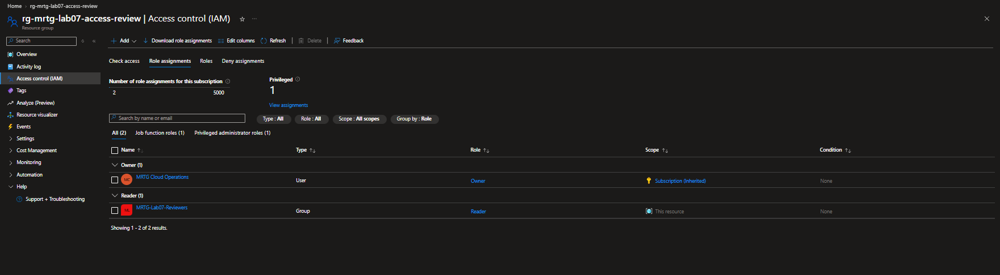
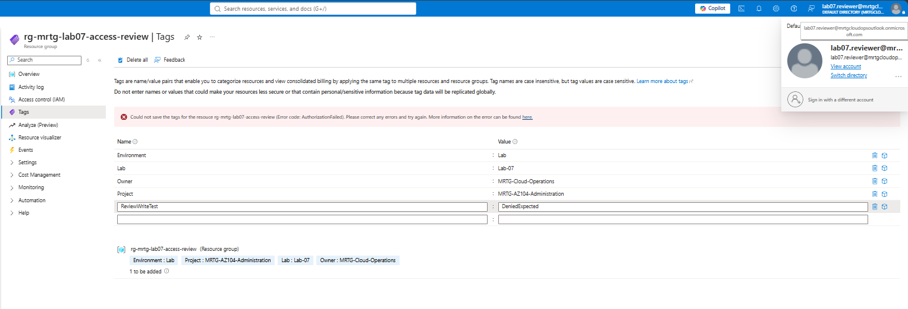

# Lab 07 — Access review and cost review

 

## Business problem and result

A synthetic reviewer needed read-only access to a temporary MRTG resource group. A deliberately excessive Contributor assignment was identified during a manual review, removed, and replaced with Reader. The reviewer successfully opened the resource group and received **AuthorizationFailed** when saving a tag.

**Status: validated; temporary role assignment, resource group, security group, and active review user cleaned up.** The evidence below comes from the restarted execution on October 4, 2026.

## Environment and scope

| Item | Recorded configuration |
|---|---|
| Subscription | MRTG-AZ104-Lab-Subscription |
| Administrator | MRTG Cloud Operations; subscription Owner inherited at resource-group scope |
| Resource group | `rg-mrtg-lab07-access-review`; Central US; empty test scope |
| Review identity | MRTG Lab07 Review User; cloud-only Member |
| Security group | `MRTG-Lab07-Reviewers`; Assigned membership; one direct reviewer member |
| Group owner | MRTG Cloud Operations |
| Tags | Environment = Lab; Project = MRTG-AZ104-Administration; Lab = Lab-07; Owner = MRTG-Cloud-Operations |
| License baseline | Entra Free; no paid Entra/Microsoft 365 license purchase or trial |

Group ownership and group membership were reviewed separately. The Owner tag is metadata; it grants no access. This is a **manual Azure RBAC review**, not the automated Microsoft Entra Access Reviews product.

## Execution

1. Reviewed October and prior-month September Cost analysis at subscription scope; captured the empty resource-group baseline and existing subscription Owner assignment.
2. Created the tagged empty resource group, enabled synthetic Member user, and Assigned security group.
3. Set the administrator as group owner and added only the reviewer as a direct member.
4. Assigned the group Contributor on the temporary resource group to introduce the controlled excessive-access finding.
5. Compared the assignment with the read-only business requirement. Removed Contributor and assigned Reader to the same group at the same scope.
6. Used resource-group IAM **Check access** for the reviewer; confirmed Reader through the group.
7. Opened a separate reviewer session and loaded the resource group's Overview.
8. Attempted to save `ReviewWriteTest = DeniedExpected` under Tags. Azure rejected the write with **AuthorizationFailed**.
9. Returned to the administrator session, removed the temporary Reader assignment, and verified only inherited Owner remained.
10. Deleted the resource group and security group, then deleted the synthetic user from active users.
11. Rechecked October Cost analysis after cleanup.

## Review finding

| Requirement | Excessive access | Remediation | Observed result |
|---|---|---|---|
| Reviewer reads this resource group | Contributor at resource-group scope | Replace Contributor with Reader through the Assigned security group | Overview loaded; tag write rejected |

The group-derived role check established the assignment path; the reviewer session established actual read and write behavior. Visible portal buttons alone were not treated as proof of permission.

## Validation evidence

All **19 screenshots** are linked in execution order. Filenames have no upload collision suffixes.

| Evidence | What it proves |
|---|---|
| [October cost baseline](screenshots/lab07-cost-baseline.png) | Actual cost `--`; no cost reported. |
| [September cost review](screenshots/lab07-prior-month-cost-review.png) | Prior month also had no reported cost. |
| [Resource group baseline](screenshots/lab07-resource-groups-baseline.png) | No resource groups displayed before setup. |
| [Subscription access baseline](screenshots/lab07-subscription-access-baseline.png) | Existing administrator Owner at subscription scope. |
| [Temporary resource group](screenshots/lab07-resource-group-created.png) | Central US, four tags, no deployments or listed resources. |
| [Synthetic reviewer](screenshots/lab07-review-user-created.png) | Enabled Member; no licenses or directory roles shown at creation. |
| [Assigned security group](screenshots/lab07-review-group-created.png) | Cloud security group with Assigned membership. |
| [Group ownership](screenshots/lab07-review-group-owner.png) | MRTG Cloud Operations is the sole listed owner. |
| [Group membership](screenshots/lab07-review-group-membership.png) | MRTG Lab07 Review User is the sole direct member. |
| [Excessive assignment](screenshots/lab07-excessive-contributor-assignment.png) | Group Contributor at This resource; administrator Owner inherited. |
| [Reader remediation](screenshots/lab07-reader-remediation.png) | Reader replaces Contributor at This resource. |
| [User assignment check](screenshots/lab07-review-user-effective-access.png) | Reader derived through MRTG-Lab07-Reviewers. |
| [Read test](screenshots/lab07-reviewer-read-verified.png) | Reviewer identity and loaded resource group Overview. |
| [Write test](screenshots/lab07-reviewer-tag-write-denied.png) | Tag save failed with AuthorizationFailed. |
| [Role cleanup](screenshots/lab07-role-assignment-cleanup.png) | Only inherited administrator Owner remains. |
| [Resource group cleanup](screenshots/lab07-resource-group-cleanup.png) | No resource groups displayed with all subscriptions/locations selected. |
| [Group cleanup](screenshots/lab07-review-group-cleanup.png) | Exact group-name search returns zero groups. |
| [Active user cleanup](screenshots/lab07-review-user-cleanup.png) | Unfiltered active list contains only original administrator. |
| [Final October cost review](screenshots/lab07-final-cost-review.png) | Actual cost `--`; no cost reported after cleanup. |

### Least-privilege correction

### Actual denied write

## Cleanup and cost result

The role-assignment cleanup capture shows only the original administrator's inherited subscription Owner. The resource-group list is empty, the review-group search returns zero results, and the active-user list contains only the administrator. Permanent user deletion and post-removal session enforcement were not tested.

September and October Cost analysis showed **Actual cost `--`** and **No cost reported during this period**. The final October view showed the same result. No metered workload was deployed. These captures do not establish a finalized $0 invoice, available credits, cumulative cash spend, or continued budget-alert configuration; the cost views show Budget: None.

## Operational lessons and evidence limits

- Review permissions against a stated business need; a valid assignment can still be excessive.
- Check membership, ownership, assignment scope, and inheritance before changing a role.
- Test both a required action and a prohibited action as the actual user.
- Remove temporary role assignments before deleting their principals and test scope.
- Cost-analysis absence is recorded as absence of reported data, not a verified bill.
- No automated access review, premium identity governance, PIM, storage data access, or role-change audit-log review is claimed.

[All labs](../../docs/progress.md) · [Access matrix](../../docs/access-control-matrix.md) · [Cost ledger](../../docs/cost-ledger.md) · [Series prerequisites](../../docs/licensing-and-prerequisites.md)
